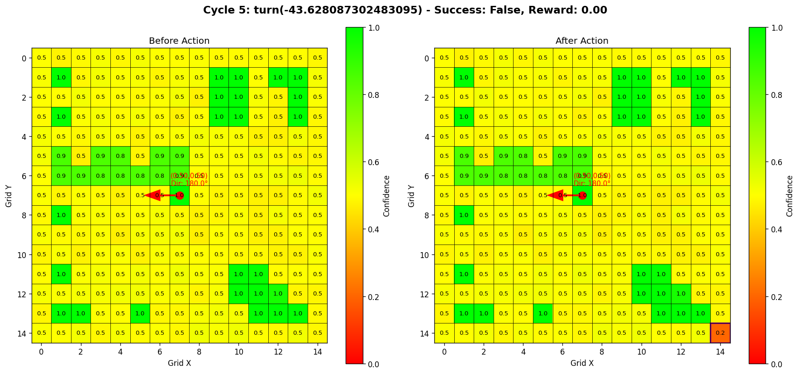
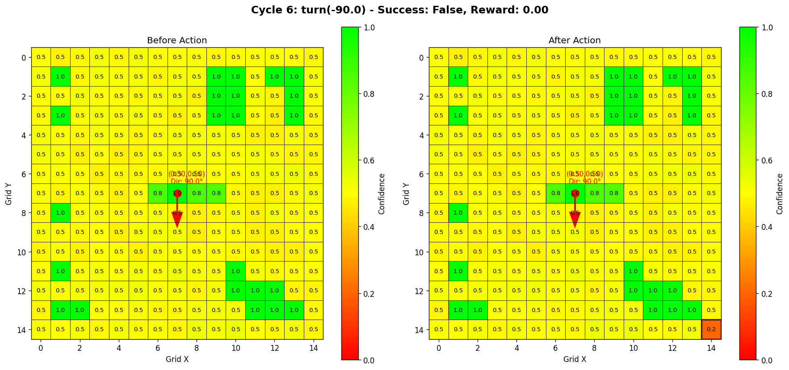

# 游戏智能体行为报告

## 实验概览
- **实验时间**: 2025-06-15 13:11:25
- **总循环次数**: 6

## 行为统计
| 行为类型 | 执行次数 | 执行比例 |
|----------|----------|----------|
| turn | 2 | 33.3% |
| move | 5 | 83.3% |

## 地图演变过程

### 循环 0: turn(-135.0) (成功: ✗, 奖励: 4.00)

**行为详情**:
- 行为类型: turn
- 行为参数: -135.0
- 是否成功: 否
- 获得奖励: 4.00
- 角色位置: (0.50, 0.50)
- 角色方向: 225.0°

### 循环 1: turn(-45.0) (成功: ✗, 奖励: 4.00)

**行为详情**:
- 行为类型: turn
- 行为参数: -45.0
- 是否成功: 否
- 获得奖励: 4.00
- 角色位置: (0.50, 0.50)
- 角色方向: 180.0°

### 循环 2: move(0.1428571428571429) (成功: ✗, 奖励: 3.50)

**行为详情**:
- 行为类型: move
- 行为参数: 0.1428571428571429
- 是否成功: 否
- 获得奖励: 3.50
- 角色位置: (0.40, 0.50)
- 角色方向: 180.0°

### 循环 3: move(0.1428571428571429) (成功: ✗, 奖励: 3.50)

**行为详情**:
- 行为类型: move
- 行为参数: 0.1428571428571429
- 是否成功: 否
- 获得奖励: 3.50
- 角色位置: (0.30, 0.50)
- 角色方向: 180.0°

### 循环 4: move(0.1428571428571429) (成功: ✗, 奖励: 3.50)

**行为详情**:
- 行为类型: move
- 行为参数: 0.1428571428571429
- 是否成功: 否
- 获得奖励: 3.50
- 角色位置: (0.20, 0.50)
- 角色方向: 180.0°

### 循环 5: move(0.1428571428571429) (成功: ✗, 奖励: 3.50)

**行为详情**:
- 行为类型: move
- 行为参数: 0.1428571428571429
- 是否成功: 否
- 获得奖励: 3.50
- 角色位置: (0.10, 0.50)
- 角色方向: 180.0°

### 循环 6: move(0.1428571428571429) (成功: ✗, 奖励: 3.50)

**行为详情**:
- 行为类型: move
- 行为参数: 0.1428571428571429
- 是否成功: 否
- 获得奖励: 3.50
- 角色位置: (0.00, 0.50)
- 角色方向: 180.0°

**报告生成时间**: 2025-06-15 13:11:25