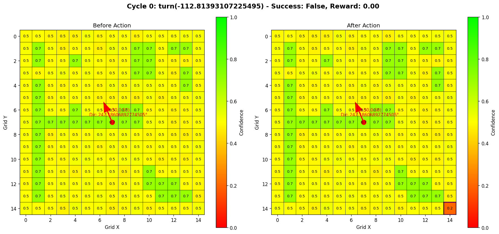
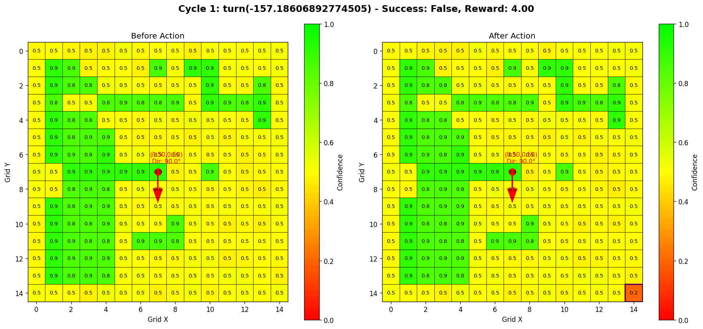

# 游戏智能体行为报告

## 实验概览
- **实验时间**: 2025-06-17 18:26:56
- **总循环次数**: 4

## 行为统计
| 行为类型 | 执行次数 | 执行比例 |
|----------|----------|----------|
| turn | 3 | 75.0% |
| move | 2 | 50.0% |

## 地图演变过程

### 循环 0: turn(-180.0) (成功: ✗, 奖励: 0.00)

**行为详情**:
- 行为类型: turn
- 行为参数: -180.0
- 是否成功: 否
- 获得奖励: 0.00
- 角色位置: (0.50, 0.50)
- 角色方向: 180.0°

### 循环 1: move(0.22515642514765125) (成功: ✓, 奖励: 9.03)

**行为详情**:
- 行为类型: move
- 行为参数: 0.22515642514765125
- 是否成功: 是
- 获得奖励: 9.03
- 角色位置: (0.40, 0.50)
- 角色方向: 180.0°

### 循环 2: move(0.1428571428571429) (成功: ✗, 奖励: 3.50)

**行为详情**:
- 行为类型: move
- 行为参数: 0.1428571428571429
- 是否成功: 否
- 获得奖励: 3.50
- 角色位置: (0.30, 0.50)
- 角色方向: 180.0°

### 循环 3: turn(-17.28149837181661) (成功: ✗, 奖励: 0.00)

**行为详情**:
- 行为类型: turn
- 行为参数: -17.28149837181661
- 是否成功: 否
- 获得奖励: 0.00
- 角色位置: (0.30, 0.50)
- 角色方向: 162.7185016281834°

### 循环 4: turn(155.64795903524754) (成功: ✗, 奖励: 4.00)

**行为详情**:
- 行为类型: turn
- 行为参数: 155.64795903524754
- 是否成功: 否
- 获得奖励: 4.00
- 角色位置: (0.30, 0.50)
- 角色方向: 318.3664606634309°

**报告生成时间**: 2025-06-17 18:26:56